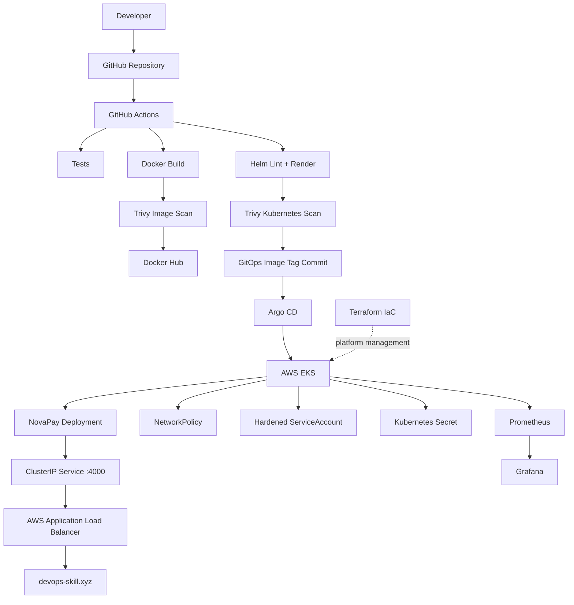

# NovaPay — Production-Style DevOps / Cloud-Native Project

> **A full-stack banking application taken from local development to a production-style AWS EKS deployment with CI/CD, GitOps, Kubernetes security, observability, and Terraform IaC.**

[](https://github.com/alok8700-web/novapay-app/actions/workflows/ci.yml)

## 🚀 Project Overview

NovaPay is a full-stack banking application with authentication, dashboards, wallets, transactions and money-transfer functionality.

The project has been progressively converted into a **real-world DevOps deployment** rather than remaining only a local React/Node application.

The final deployment path is:

```text
Developer
   │
   ▼
GitHub ── Pull Request / Push
   │
   ▼
GitHub Actions
   │
   ├── Install dependencies
   ├── Run tests
   ├── Build frontend
   ├── Build Docker image
   ├── Trivy image vulnerability scan
   ├── Helm lint + render
   ├── Trivy Kubernetes misconfiguration scan
   └── Push immutable image tagged with Git SHA
   │
   ▼
GitOps update
helm/novapay/values.yaml
   │
   ▼
Argo CD
   │
   ▼
AWS EKS — novapay-eks
   │
   ├── NovaPay Deployment (2 replicas, HPA up to 5)
   ├── ClusterIP Service :4000
   ├── AWS Load Balancer Controller
   ├── Internet-facing AWS ALB
   ├── Kubernetes NetworkPolicy
   ├── Kubernetes ServiceAccount hardening
   └── Kubernetes Secret for JWT_SECRET
   │
   ▼
https://devops-skill.xyz
   │
   ▼
NovaPay API / Frontend

Observability
   ├── Prometheus
   ├── Grafana
   └── Application health dashboards

Infrastructure as Code
   └── Terraform foundation for the existing EKS platform
```

---

## 🖼️ Architecture



---

# 🧰 Technology Stack

### Application

- React
- Vite
- CSS responsive layout
- Node.js
- Express
- JWT authentication
- bcrypt password hashing
- Helmet
- CORS
- Zod validation

### DevOps / Cloud

- AWS
- Amazon EKS
- EC2 / Amazon Linux
- Docker
- Docker Hub
- Kubernetes
- Helm
- Argo CD
- GitHub Actions
- Terraform
- AWS Load Balancer Controller
- AWS Application Load Balancer

### Security

- Trivy container vulnerability scanning
- Trivy Kubernetes/Helm misconfiguration scanning
- Kubernetes NetworkPolicy
- Non-root container execution
- `allowPrivilegeEscalation: false`
- Linux capabilities dropped
- Read-only root filesystem
- Kubernetes ServiceAccount token disabled
- Kubernetes Secret for `JWT_SECRET`
- Git SHA immutable image tags

### Observability

- Prometheus
- Grafana
- Application health monitoring
- Kubernetes resource monitoring

---

# 📁 Repository Structure

```text
novapay-app/
│
├── frontend/                  # React frontend
├── backend/                   # Node.js / Express API
│
├── helm/
│   └── novapay/
│       ├── templates/
│       │   ├── deployment.yaml
│       │   ├── service.yaml
│       │   ├── ingress.yaml
│       │   ├── hpa.yaml
│       │   ├── networkpolicy.yaml
│       │   ├── serviceaccount.yaml
│       │   └── configmap.yaml
│       ├── Chart.yaml
│       └── values.yaml
│
├── terraform/
│   ├── README.md
│   ├── versions.tf
│   ├── variables.tf
│   ├── data.tf
│   ├── providers.tf
│   ├── namespaces.tf
│   └── terraform.tfvars.example
│
├── .github/
│   └── workflows/
│       └── ci.yml
│
├── Dockerfile
├── docker-compose.yml
├── package.json
└── README.md
```

---

# 1. 💻 Local Application Development

The project started as a normal full-stack application.

Install dependencies:

```bash
npm run install:all
```

Run locally:

```bash
npm run dev
```

Application endpoints:

```text
Frontend: http://localhost:5173
Backend:  http://localhost:4000/api
```

Production build:

```bash
npm run build
npm test
```

---

# 2. 🐳 Dockerization

The application was converted into a containerized workload using a **multi-stage Docker build**.

Build:

```bash
docker build -t alokdocker8700/novapay:latest .
```

Run:

```bash
docker run --rm -p 4000:4000 alokdocker8700/novapay:latest
```

The production image contains the built application and avoids carrying unnecessary build-time dependencies into the runtime image.

---

# 3. ☸️ Kubernetes Deployment

The application was packaged as a Helm chart instead of maintaining large static Kubernetes YAML files.

The Helm chart manages:

- Deployment
- Service
- Ingress
- HPA
- ConfigMap
- Secret reference
- NetworkPolicy
- ServiceAccount

The application listens on port `4000`.

Current Helm configuration uses:

```yaml
replicaCount: 2

container:
  port: 4000

service:
  type: ClusterIP
  port: 4000
```

The deployment requests `100m` CPU / `128Mi` memory and limits the container to `500m` CPU / `256Mi` memory. citeturn12file0

---

# 4. 🔐 Kubernetes Secret Management

`JWT_SECRET` is **not hard-coded into the Helm deployment**.

The application receives it through an existing Kubernetes Secret:

```yaml
env:
  - name: JWT_SECRET
    valueFrom:
      secretKeyRef:
        name: novapay-secret
        key: JWT_SECRET
```

The Git repository only contains the example environment configuration; secret values are kept outside Git.

This was verified inside the running pod without printing the secret value itself.

---

# 5. 🛡️ Kubernetes Security Hardening

Several security controls were added during the project.

## Non-root container

```yaml
securityContext:
  runAsNonRoot: true
```

## Disable privilege escalation

```yaml
allowPrivilegeEscalation: false
```

## Drop Linux capabilities

```yaml
capabilities:
  drop:
    - ALL
```

## Read-only root filesystem

Trivy initially reported `KSV-0014` because the container root filesystem was writable.

The deployment was updated to enable:

```yaml
readOnlyRootFilesystem: true
```

The application was checked for filesystem writes before enabling this control, and the final Trivy Helm and rendered-Kubernetes scans reported **0 HIGH/CRITICAL misconfigurations**.

## ServiceAccount hardening

A dedicated `novapay` ServiceAccount was introduced with:

```yaml
automountServiceAccountToken: false
```

The Deployment explicitly uses it:

```yaml
serviceAccountName: novapay
```

The running pod was verified to have **no mounted Kubernetes ServiceAccount token**.

---

# 6. 🌐 Kubernetes NetworkPolicy

Network traffic was restricted with a NetworkPolicy for the NovaPay pods.

The policy allows the application ingress on:

```text
TCP 4000
```

DNS egress is allowed to `kube-system` on:

```text
UDP 53
TCP 53
```

The application was tested from another Kubernetes pod:

```bash
kubectl run network-test \\
  --rm -it \\
  --restart=Never \\
  --image=curlimages/curl \\
  -- curl -s http://novapay-service:4000/api/health
```

Expected response:

```json
{
  "status": "ok",
  "service": "novapay-api",
  "version": "gitops-v2"
}
```

---

# 7. 🔄 GitHub Actions CI/CD

The repository contains a GitHub Actions pipeline in `.github/workflows/ci.yml`. The workflow runs for pushes and pull requests targeting `main`. fileciteturn11file0

Pipeline:

```text
Checkout
   ↓
Node.js 22
   ↓
npm install
   ↓
npm run install:all
   ↓
npm test
   ↓
npm run build
   ↓
Docker Buildx
   ↓
Build immutable image using Git SHA
   ↓
Trivy HIGH/CRITICAL image scan
   ↓
Docker Hub push
   ↓
Helm lint
   ↓
Helm template
   ↓
Validate rendered manifests
   ↓
Trivy Kubernetes misconfiguration scan
   ↓
Update helm/novapay/values.yaml
   ↓
Commit GitOps desired state
```

A major design decision is that the image is built and scanned **before it is published**. The Git SHA is used as the immutable deployment tag. fileciteturn11file0

---

# 8. 🔍 Trivy Security Gates

Two different Trivy scans are used.

### Container image scan

```yaml
scanners: vuln
severity: HIGH,CRITICAL
exit-code: '1'
```

A failed HIGH/CRITICAL vulnerability scan prevents the image from being published.

### Kubernetes manifest scan

The rendered Helm manifests are scanned using:

```yaml
scan-type: config
scanners: misconfig
severity: HIGH,CRITICAL
exit-code: '1'
```

This caught the writable root filesystem issue during development. After remediation, both the Helm chart and rendered Kubernetes manifests returned **0 HIGH/CRITICAL findings**.

This demonstrates an important DevSecOps principle:

> **Security is a gate in the delivery pipeline, not a manual check after deployment.**

---

# 9. 📦 Docker Image / GitOps Versioning

The CI pipeline publishes:

```text
alokdocker8700/novapay:<GIT_SHA>
alokdocker8700/novapay:latest
```

The Helm desired state is then updated to the Git SHA rather than relying only on `latest`.

Example:

```yaml
image:
  repository: alokdocker8700/novapay
  tag: <git-sha>
  pullPolicy: Always
```

This gives each deployment a traceable relationship:

```text
Git commit
    ↓
Docker image tag
    ↓
Helm values
    ↓
Argo CD revision
    ↓
Kubernetes Deployment
```

---

# 10. 🔁 GitOps with Argo CD

Argo CD is the deployment controller.

The CI pipeline does **not** directly run `kubectl apply` against EKS.

Instead:

```text
GitHub Actions
     │
     │ update desired image tag
     ▼
Git repository
     │
     ▼
Argo CD detects Git change
     │
     ▼
Argo CD syncs Helm application
     │
     ▼
EKS
```

This creates a clean separation:

- **CI** → build, test, scan and publish
- **Git** → desired state
- **Argo CD** → deployment
- **Kubernetes** → runtime

The NovaPay Argo CD application was verified as `Synced` and `Healthy` during the deployment work.

---

# 11. ☁️ AWS EKS Infrastructure

The application is running on an Amazon EKS cluster:

```text
Cluster: novapay-eks
Region: us-east-1
Kubernetes: 1.33
VPC: vpc-07426b49d12469e09
```

The worker node group is:

```text
novapay-ng
Instance type: t3.small
```

The cluster uses the AWS Load Balancer Controller to provision the application Load Balancer.

---

# 12. 🌍 Production-style Ingress

NovaPay is exposed through an AWS Application Load Balancer using Kubernetes Ingress.

Configured hosts:

```text
devops-skill.xyz
www.devops-skill.xyz
```

Ingress class:

```text
alb
```

Scheme:

```text
internet-facing
```

Target type:

```text
ip
```

The Helm values also configure an ACM certificate ARN for HTTPS termination. fileciteturn12file0

Production traffic path:

```text
Internet
   ↓
DNS
   ↓
AWS ALB
   ↓
Kubernetes Ingress
   ↓
NovaPay ClusterIP Service :4000
   ↓
NovaPay Pods
```

---

# 13. 📈 Horizontal Pod Autoscaling

The application is configured with HPA:

```yaml
hpa:
  enabled: true
  minReplicas: 2
  maxReplicas: 5
  targetCPUUtilizationPercentage: 50
```

This means Kubernetes can scale the application from 2 to 5 replicas based on CPU utilization. fileciteturn12file0

---

# 14. 📊 Observability

Observability was added using Kubernetes monitoring components including Prometheus and Grafana.

The goal is to monitor:

- Application health
- Pod health
- CPU utilization
- Memory utilization
- Kubernetes workload behavior
- Service availability

NovaPay API health is exposed through:

```text
GET /api/health
```

Example:

```json
{
  "status": "ok",
  "service": "novapay-api",
  "version": "gitops-v2"
}
```

### Grafana dashboard

A NovaPay API health dashboard was created for the deployment.

> The dashboard is environment-specific and may require access to the running monitoring environment.

---

# 15. 🏗️ Terraform — Infrastructure as Code

Terraform was introduced to teach and establish the **IaC layer** for the project.

The existing EKS infrastructure was created outside Terraform, so the first Terraform stage intentionally uses AWS data sources to discover the existing environment rather than creating a duplicate cluster.

Current Terraform structure:

```text
terraform/
├── README.md
├── versions.tf
├── variables.tf
├── data.tf
├── providers.tf
├── namespaces.tf
└── terraform.tfvars.example
```

Terraform discovers:

```text
AWS Region
    ↓
Existing EKS Cluster
    ↓
Existing VPC
    ↓
Kubernetes Provider
    ↓
Helm Provider
```

The Terraform foundation was validated successfully with:

```bash
terraform init
terraform validate
terraform plan
```

The important lesson is that **IaC does not always mean recreating everything from zero**. Terraform can first discover existing infrastructure and progressively take ownership of additional resources.

---

# 16. 🔬 SonarQube and Nexus — Next DevOps Stage

SonarQube and Nexus were identified as the next major platform components for the project.

The intended pipeline will become:

```text
GitHub
  ↓
GitHub Actions
  ↓
Unit Tests
  ↓
SonarQube Code Quality
  ↓
Docker Build
  ↓
Trivy Security Scan
  ↓
Nexus / Artifact Management
  ↓
Docker Registry
  ↓
GitOps
  ↓
Argo CD
  ↓
EKS
```

**Important:** SonarQube and Nexus are documented here as the next stage of the project. They should not be represented as production components unless they are actually installed and verified in the cluster.

Terraform already provides the foundation for dedicated platform namespaces:

```text
sonarqube
nexus
```

---

# 17. 🧪 Deployment Verification

After deployment, the following checks were used to verify the system.

### Kubernetes

```bash
kubectl get pods -l app=novapay
kubectl get svc
kubectl get ingress
kubectl get networkpolicy
kubectl get serviceaccount novapay
```

### Application health

```bash
POD=$(kubectl get pods -l app=novapay -o jsonpath='{.items[0].metadata.name}')

kubectl exec "$POD" -- \
  wget -qO- http://localhost:4000/api/health
```

Expected:

```json
{"status":"ok","service":"novapay-api","version":"gitops-v2"}
```

### Service-to-service connectivity

```bash
kubectl run network-test \\
  --rm -it \\
  --restart=Never \\
  --image=curlimages/curl \\
  -- curl -s http://novapay-service:4000/api/health
```

### Argo CD

```bash
kubectl get application novapay -n argocd
```

Expected:

```text
SYNC STATUS     HEALTH STATUS
Synced          Healthy
```

### ServiceAccount security

```bash
kubectl exec "$POD" -- sh -c '
if [ -d /var/run/secrets/kubernetes.io/serviceaccount ]; then
  echo "WARNING: service account token is mounted"
else
  echo "PASS: service account token is not mounted"
fi
'
```

Expected:

```text
PASS: service account token is not mounted
```

---

# 18. 🛠️ Complete End-to-End Deployment Procedure

This is the complete flow to reproduce the deployment after the infrastructure prerequisites are available.

## Step 1 — Clone

```bash
git clone https://github.com/alok8700-web/novapay-app.git
cd novapay-app
```

## Step 2 — Test application

```bash
npm run install:all
npm test
npm run build
```

## Step 3 — Build Docker image

```bash
docker build -t alokdocker8700/novapay:<GIT_SHA> .
```

## Step 4 — Validate Helm

```bash
helm lint helm/novapay
helm template novapay helm/novapay > /tmp/novapay-rendered.yaml
```

## Step 5 — Security scan

```bash
trivy image alokdocker8700/novapay:<GIT_SHA>
trivy config helm/novapay
```

The CI pipeline enforces HIGH/CRITICAL gates automatically.

## Step 6 — Push application changes

```bash
git add .
git commit -m "feat: deploy NovaPay"
git push origin main
```

## Step 7 — CI builds and publishes

GitHub Actions:

```text
Test
 → Build
 → Docker
 → Trivy
 → Docker Hub
 → Helm validation
 → Trivy Kubernetes scan
 → GitOps commit
```

## Step 8 — Argo CD deploys

Argo CD detects the updated Helm image tag and syncs the application into EKS.

## Step 9 — Verify Kubernetes

```bash
kubectl get pods -l app=novapay
kubectl get svc novapay-service
kubectl get ingress novapay-ingress
```

## Step 10 — Verify health

```bash
kubectl exec "$POD" -- wget -qO- http://localhost:4000/api/health
```

## Step 11 — Verify Argo CD

```bash
kubectl get application novapay -n argocd
```

## Step 12 — Verify security

```bash
kubectl get networkpolicy
kubectl get serviceaccount novapay -o yaml
```

## Step 13 — Verify public endpoint

Open:

```text
https://devops-skill.xyz
```

At this point the deployment path is complete:

```text
Code
 → GitHub
 → CI
 → Tests
 → Docker
 → Security Scan
 → Docker Hub
 → GitOps Commit
 → Argo CD
 → EKS
 → ALB
 → DNS
 → NovaPay
 → Prometheus/Grafana
```

---

# 19. 🎯 What This Project Demonstrates

This project is designed to demonstrate practical DevOps skills rather than isolated tool knowledge.

### CI/CD

- GitHub Actions
- Automated testing
- Automated builds
- Docker image publishing
- Immutable Git SHA releases

### Kubernetes

- Deployments
- Services
- Ingress
- HPA
- ConfigMaps
- Secrets
- NetworkPolicies
- ServiceAccounts
- Security contexts

### AWS

- EKS
- EC2 worker nodes
- VPC
- Application Load Balancer
- AWS Load Balancer Controller
- ACM
- EBS storage classes

### GitOps

- Argo CD
- Git as desired state
- Automated synchronization
- Separation of CI and CD

### DevSecOps

- Trivy container scanning
- Kubernetes manifest scanning
- Non-root containers
- Read-only filesystem
- Dropped capabilities
- Disabled privilege escalation
- Secret management
- Network isolation

### IaC

- Terraform
- AWS provider
- Kubernetes provider
- Helm provider
- Existing infrastructure discovery
- Progressive infrastructure management

### Observability

- Prometheus
- Grafana
- Application health monitoring
- Kubernetes resource monitoring

---

# 20. 🧭 Future Improvements

The project can continue toward a stronger production-grade platform with:

- SonarQube quality gates
- Nexus artifact repository
- Terraform-managed EKS/VPC lifecycle
- AWS Secrets Manager
- External Secrets Operator
- ECR instead of Docker Hub
- TLS/HTTPS end-to-end hardening
- Route 53 DNS automation
- CloudWatch integration
- Loki / Tempo integration
- Alertmanager notifications
- Pod disruption budgets
- NetworkPolicy default-deny model
- Resource quotas and limit ranges
- Backup and disaster recovery
- Terraform remote state in S3 with locking
- Separate dev/staging/prod environments
- GitHub Actions environment protection
- OIDC-based AWS authentication instead of long-lived credentials

---

# 🏆 Final Architecture

```text
                         ┌───────────────────┐
                         │     Developer     │
                         └─────────┬─────────┘
                                   │
                                   ▼
                         ┌───────────────────┐
                         │      GitHub       │
                         └─────────┬─────────┘
                                   │
                                   ▼
                    ┌────────────────────────────┐
                    │      GitHub Actions        │
                    │                            │
                    │ Test → Build → Scan        │
                    │ Helm → Scan → Publish      │
                    └─────────────┬──────────────┘
                                  │
                    ┌─────────────┴─────────────┐
                    ▼                           ▼
             ┌──────────────┐            ┌──────────────┐
             │ Docker Hub   │            │ GitOps Repo  │
             └──────────────┘            └──────┬───────┘
                                                │
                                                ▼
                                         ┌─────────────┐
                                         │   Argo CD   │
                                         └──────┬──────┘
                                                │
                                                ▼
                                  ┌────────────────────────┐
                                  │       AWS EKS           │
                                  │                        │
                                  │  NovaPay × 2 → HPA    │
                                  │  Service / Ingress     │
                                  │  NetworkPolicy         │
                                  │  Secure ServiceAccount │
                                  │  Kubernetes Secret     │
                                  └───────────┬────────────┘
                                              │
                                              ▼
                                       ┌────────────┐
                                       │ AWS ALB    │
                                       └─────┬──────┘
                                             │
                                             ▼
                                      devops-skill.xyz

              ┌─────────────────────────────────────────┐
              │ Observability: Prometheus + Grafana    │
              └─────────────────────────────────────────┘

              ┌─────────────────────────────────────────┐
              │ IaC: Terraform                          │
              │ Existing EKS discovery + platform      │
              │ resource management                     │
              └─────────────────────────────────────────┘
```

---

## 📌 Project Status

| Area | Status |
|---|---|
| Full-stack application | ✅ Complete |
| Docker | ✅ Complete |
| Kubernetes | ✅ Complete |
| Helm | ✅ Complete |
| AWS EKS | ✅ Running |
| AWS ALB Ingress | ✅ Running |
| HPA | ✅ Configured |
| NetworkPolicy | ✅ Implemented |
| Kubernetes Secret | ✅ Implemented |
| ServiceAccount hardening | ✅ Implemented |
| Trivy image scanning | ✅ Implemented |
| Trivy Kubernetes scanning | ✅ Implemented |
| GitHub Actions CI | ✅ Implemented |
| GitOps image promotion | ✅ Implemented |
| Argo CD | ✅ Running |
| Prometheus/Grafana | ✅ Implemented |
| Terraform foundation | ✅ Implemented |
| SonarQube | 🔄 Next stage |
| Nexus | 🔄 Next stage |
| Full Terraform ownership of EKS/VPC | 🔄 Future stage |

---

## 👨‍💻 Author

**Alok Singh**

- GitHub: https://github.com/alok8700-web
- LinkedIn: https://www.linkedin.com/in/alok-singh-ba76751a5/

---

## ⭐ Why this project matters

NovaPay demonstrates the complete journey from **application source code to a secure, observable, GitOps-managed Kubernetes production-style deployment on AWS**.

It is intentionally built as a hands-on DevOps portfolio project covering **CI/CD + Docker + Kubernetes + Helm + AWS + GitOps + DevSecOps + Observability + Terraform IaC** rather than as a collection of disconnected tutorials.
